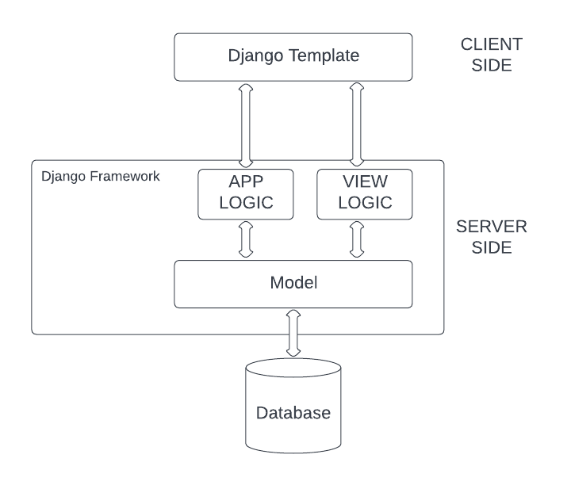

# **PBP Assignment**

Nama : Carlene Annabel

NPM : 2106752211

Kelas : D

    
Assignment 1

    <a href="https://katalog-carlene.herokuapp.com/katalog/" target= "_blank">Link Aplikasi Heroku</a>

    ## **Buatlah bagan yang berisi request client ke web aplikasi berbasis Django beserta responnya dan jelaskan pada bagan tersebut kaitan antara urls.py, views.py, models.py, dan berkas html**
    <<<<<<< HEAD
    
    =======
    
    >>>>>>> fd173a6422587afed9899c939291f525e36d888e

    Dari bagan di atas, dapat dilihat bahwa terdapat dua komponen yaitu, client side dan server side. View berada pada server side dan Template berada pada client side.

    Ketika kita membuat request untuk sebuah website, interface yang digunakan untuk membuat permintaan tersebut melalui browser disebut Template. Kemudian permintaan tersebut dikirmkan ke server untuk pengelolaan file view. Setiap kali Template diperbaharui, itu adalah input yang dikirim dan dimana diserver akan dilihat oleh View. Dan, kemudian ditransportasikan ke URL yang benar.

    Setelah ditransportasikan ke URL yang benar, lohika aplikasi berlaku dan Model mulai memperbaiki respons terhadap permintaan yang diberikan. Kemudian respons tertentu itu dikirim kembali ke View di mana ia kembali memeriksa respons dan mengirimkannya sebagai respons HTTP atau format pengguna yang diinginkan.Kemudian, kembali dirender oleh browser melalui Template(dalam format HTML).

    ## **Jelaskan kenapa menggunakan virtual environment? Apakah kita tetap dapat membuat aplikasi web berbasis Django tanpa menggunakan virtual environment?**

    Virtual enviroment memberikan kita lingkungan pengembangan yang independent dari host operating system. Kita dapat menginstal dan menggunakan software yang diperlukan di folder/bin virtualenv, daripada menggunakan software yang diinstal ke host machine. Karena, python development, bergantung pada berbagai macam libraries dan dependencies. 

    Kita tetap dapat membuat aplikasi web berbasis Django tanpa menggunakan virtual enviroment, namun dependencies dan libraries yang digunakan dalam pengembangannya tidak terpisahkan oleh projek - projek Django lainnya. Dalam arti lain, kita menggunakan dependencies dan libraries yang sama untuk banyak projek, sehingga dapat menimbulkan masalah ketika digunakan secara bersamaan. Jika kita bekerja dalam sebuah tim, jika anggota tim tersebut menggunakan dependencies dan libraries dengan versi yang berbeda, dapat menimbulkan error. Sehingga, lebih direkomendasikan untuk menggunakan virtual enviroment dalam pembuatan projek berbasis Django.

    ## **Jelaskan bagaimana cara kamu mengimplementasikan poin 1 sampai dengan 4 di atas**

    1. Membuat fungsi show_catalog yang menerima parameter request dan mengembalikan render(request, "katalog.html"), kemudian membuat folder template dan membuat berkas bernama katalog.html yang akan menjadi template dari web aplikasi kita.

    2. Membuat berkas urls.py untuk melakukan routing erhadap fungsi views yang telah kita buat sehingga nantinya halaman HTML dapat ditampilkan lewat browser kita. Kemudian, mendaftarkan aplikasi katalog ke dalam urls.py pada folder project_django.

    3. Menghubungkan Models dengan Views dan Template, dengan mengimport models yang sudah dibuat sebelumnya ke dalam file views.py. Memanggil query ke model database dan menyimpan hasil query tersebut ke dalam sebuah variabel. Menambahkan context sebagai parameter ketiga pada pengembalian fungsi render di fungsi show_catalog. Data yang ada pada variabel context tersebut akan ikut di-render oleh Django sehingga nantinya kita dapat memunculkan data tersebut pada halaman HTML.

    4. Melakukan mapping terhadap data yang telah ikut di-render pada fungsi views, menggunakan sintaks khusus template yang ada pada Django, {{data}}.  Melakukan iterasi terhadap variabel data yang telah ikut render ke dalam HTML.

    5. Mendeploy project ke heroku

